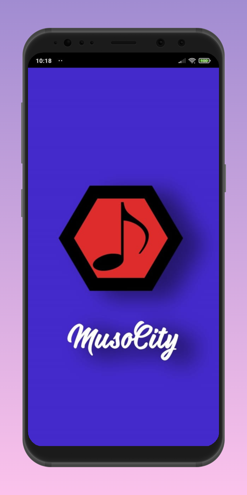
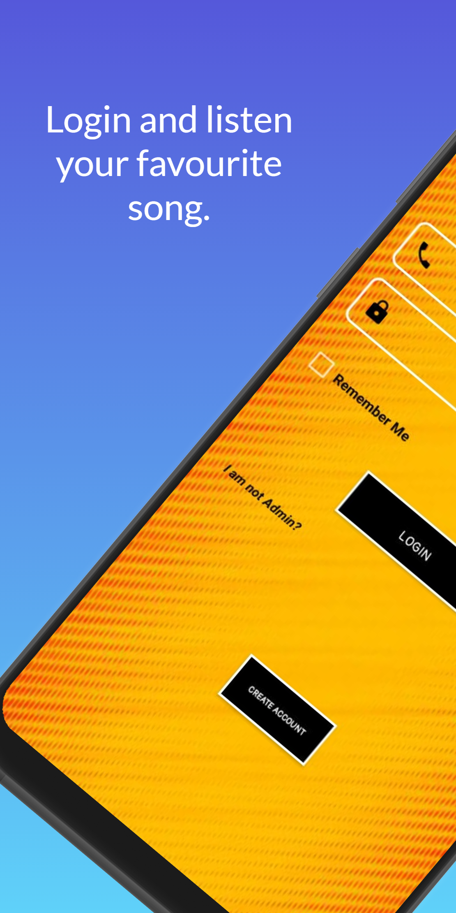
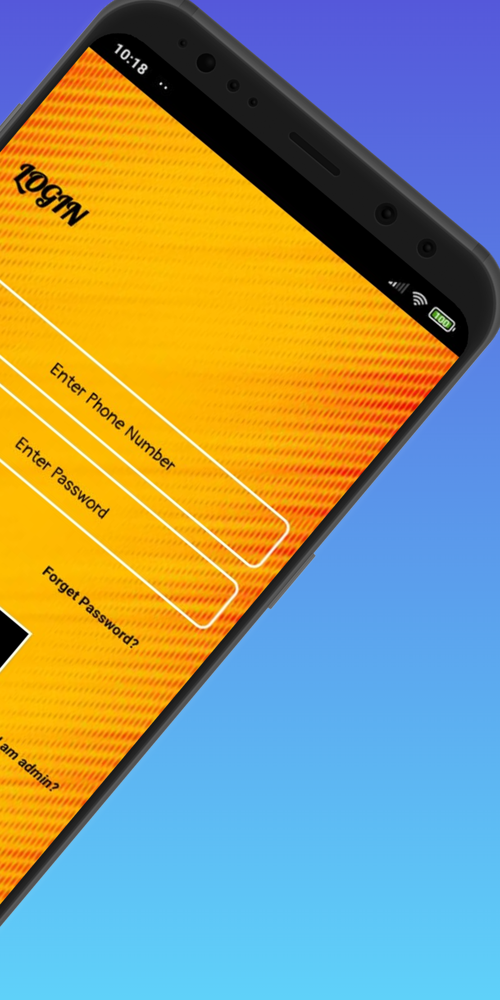
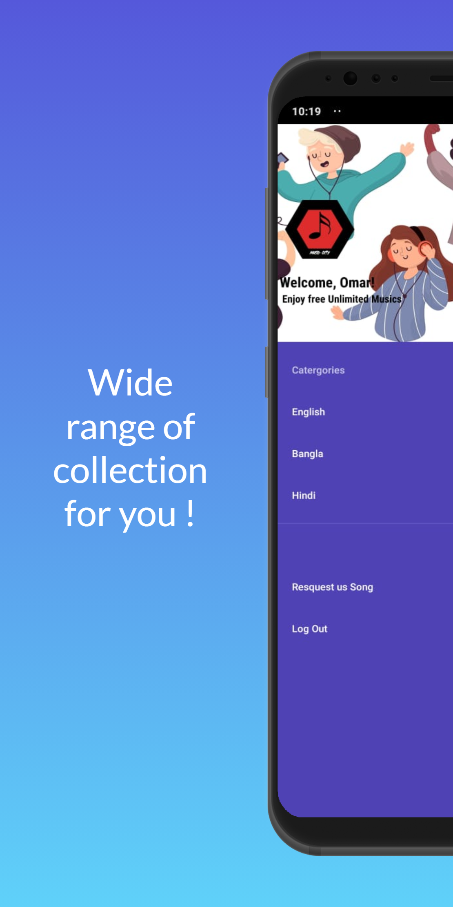
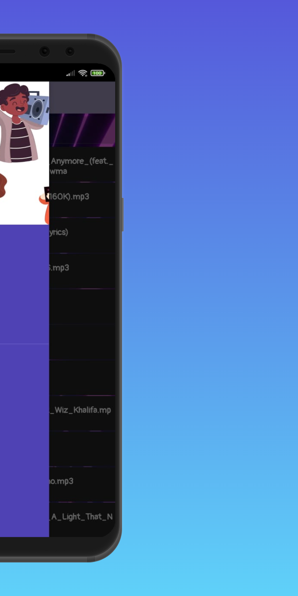
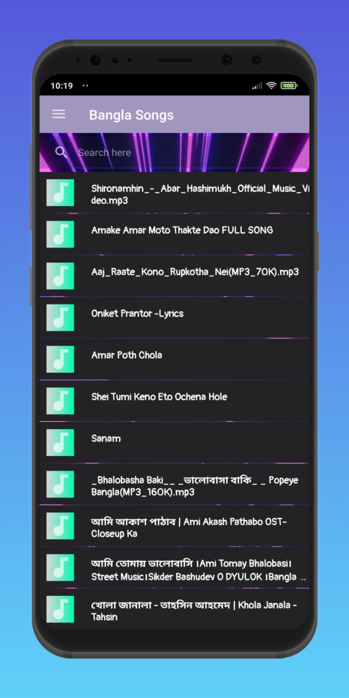

# Musocity

The Online Music Player is an Android app that allows you to listen to your favorite music tracks online. It provides a user-friendly interface. Its a project for increasing my learnign scope in Android App Development

## Screenshots

Here are some screenshots of the Musocity:
<div align="center">
  
  
  
  
  
  
</div>

## Installation

Clone the repository:

```bash
git clone https://github.com/rifaturrana/MusoCity.git
```
## Notice: App Removed from Google Play Store
Due to certain database and maintenance issues, the Online Music Player app has been removed from the Google Play Store. We apologize for any inconvenience caused.
We appreciate your understanding and support. If you have any questions or concerns, please don't hesitate to reach out to us.
